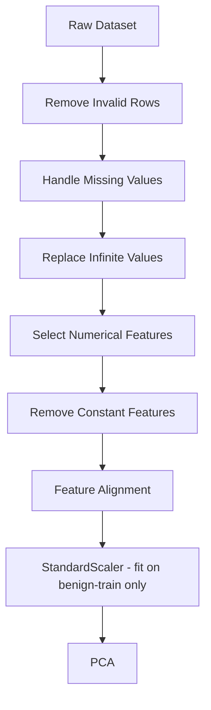
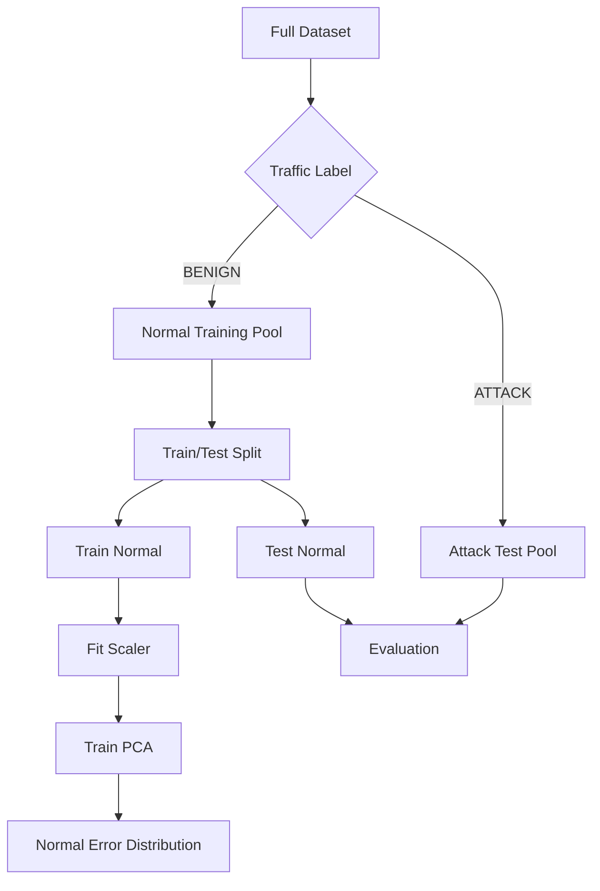
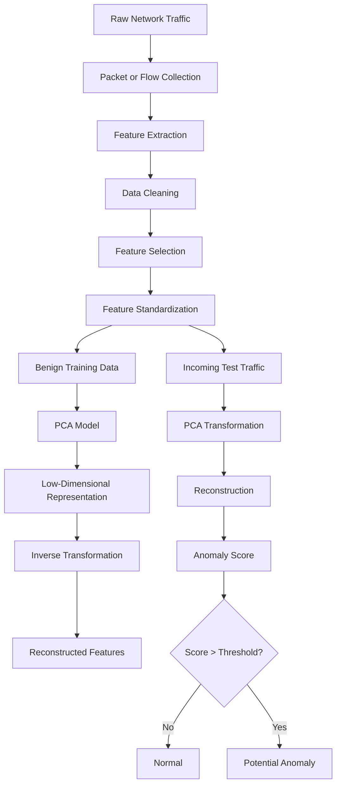
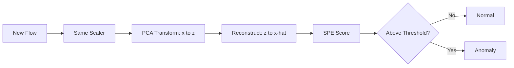
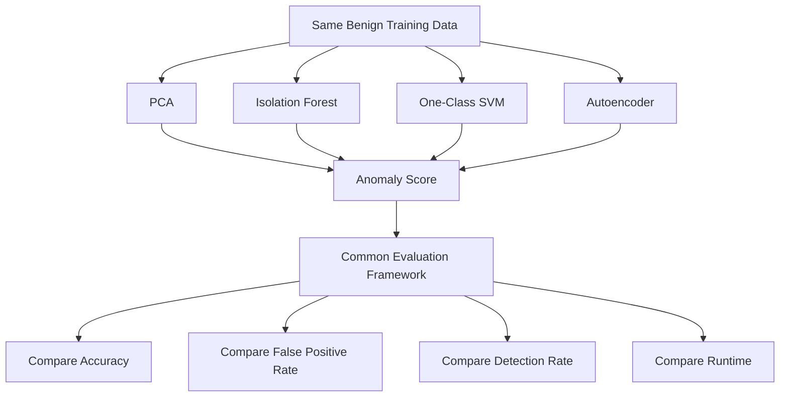

# DRD — Data & Design Requirements Document

> **Project:** PCA-Based Network Anomaly Detection
> **File:** `DRD.md`
> **Companions:** `README.md`, `PRD.md`, `TRD.md`, `ERD.md` (entities), `EDR.md` (experiments)

This document merges the two common readings of **DRD** — **Data Requirements** and **Design Requirements** — so the checklist item is satisfied either way:

- **Part A — Data Requirements:** what data is needed, in what form, with what quality gates.
- **Part B — Design Requirements:** system architecture, modules, interfaces, data flows.

All requirements are scoped to the current repo state: **docs-only + planned `src/` / `notebooks/` layout from `README.md`** (no implementation exists yet).

---

# PART A — DATA REQUIREMENTS

## A1. Data Sources

| Req | Description | Acceptance |
|-----|-------------|------------|
| D-01 | Support flow-based NIDS datasets, primary candidates **CICIDS2017/2018 family** and **UNSW-NB15** | `data/raw/README.md` lists chosen dataset(s) + URL + license + checksum |
| D-02 | Raw data stored immutable in `data/raw/`; processed outputs in `data/processed/` | Raw files never overwritten by pipeline |
| D-03 | Each dataset records environment/time provenance (network, day, window, e.g. `Mon-AM` vs `Fri-PM`) | Required for Exp4 temporal/env shift splits |
| D-04 | Label taxonomy normalised to `BENIGN + {DDoS, PortScan, Botnet, BruteForce, Other}` | Mapping table in `results/tables/label_map.csv` |

Example raw shape (from README):

| Flow Duration | Packets/s | Bytes/s | Avg Packet Size | Label |
|--------------:|----------:|--------:|----------------:|-------|
| 1200 | 20 | 5400 | 270 | BENIGN |
| 35 | 9000 | 800000 | 60 | DDoS |

## A2. Feature Requirements

| Req | Description | Acceptance |
|-----|-------------|------------|
| D-05 | Feature vector `x = [x1 … xn]`, target `n ≈ 78` numeric flow features (duration, fwd/bwd counts & lengths, bytes/s, pkts/s, IAT, avg size, variance, flag counts, ratios) | `feature_report.csv` enumerates kept/dropped with reason |
| D-06 | Drop: non-numeric (v1), constant, >threshold-missing/inf, label-derived/leaky columns | Drop reason logged per column |
| D-07 | Handle `NaN` / `±Inf` explicitly (remove row *or* impute + cap, decided in notebook 02 and frozen) | No silent coercion; counts reported |
| D-08 | Cross-dataset alignment: intersection feature set + shared scaling contract for Exp4c | `feature_alignment.csv` committed |
| D-09 | Column order frozen in `feature_list.json`; train/inference hash-checked | Mismatched order fails fast |

## A3. Preprocessing Requirements

| Req | Description | Acceptance |
|-----|-------------|------------|
| D-10 | Pipeline: `Remove invalid rows → handle NaN/Inf → select numeric → drop constant → align → StandardScaler → PCA` | Mermaid pipeline in README reproduced in code; one function per step |
| D-11 | Standardization `z = (x − μ)/σ` mandatory (PCA is scale-sensitive; e.g. `Flow Duration ~2e6` vs `Flag Count ~1`) | Scaler params persisted (`scaler.pkl`) |
| D-12 | **Fit scaler ONLY on benign-train split.** Apply (transform-only) to all test/shift data | Unit test asserts `scaler.fit` never sees attack rows |
| D-13 | Deterministic splits with `random_state`; stratify attack slices where applicable | `split_id` records fraction + seed |

Reference preprocessing flow:



## A4. Train / Test Data Contracts

| Req | Description |
|-----|-------------|
| D-14 | **One-class split:** full data → `BENIGN pool` vs `ATTACK pool`; benign pool → `train-benign / test-benign`; attack pool → held-out test (+ per-category slices) |
| D-15 | Minimum viable volumes (to be confirmed in EDA): enough benign-train to estimate covariance for `n≈78` (≥ several thousand flows); each reported attack slice ≥ ~500 flows or flagged as low-support |
| D-16 | Shift suites: (a) temporal `Mon-AM → Fri-PM`, (b) environment `Net A → Net B`, (c) cross-dataset `A → B`. Each includes `shift-benign` + attack traffic |
| D-17 | No duplicate `flow_id` across splits; lineage `(dataset_id, matrix_id, split_id)` stored with every score/prediction |



## A5. Data Quality Gates

| Gate | Check | Blocks |
|------|-------|--------|
| Q-01 | Missing/inf rates per column reported in notebook 01 | Phase 2 start |
| Q-02 | Class imbalance table (counts + %) | Exp1 design |
| Q-03 | Constant-feature + duplicate-row report | PCA training |
| Q-04 | Scaler sanity: train-benign scaled mean≈0, std≈1 | Model acceptance |
| Q-05 | Score sanity: median(attack scores) > P90(benign-train scores) or documented failure | Threshold acceptance |

---

# PART B — DESIGN REQUIREMENTS

## B1. System Architecture

Layered anomaly-detection pipeline (from README):



Runtime detection path:



## B2. Module Design (planned `src/`)

Source of truth is `README.md` → Project Structure. Each module has one responsibility:

| Module | Responsibility | Key API (planned) | Inputs → Outputs |
|--------|----------------|-------------------|------------------|
| `data_loader.py` | Ingest CSVs, normalise labels, emit `flow_id` | `load_dataset(path) -> DataFrame` | `data/raw/*` → `NetworkFlow` frame |
| `preprocessing.py` | Clean, select, split, fit/apply scaler | `fit_preprocessor(train_benign)`, `transform(df)` | raw frame → `PreprocessedMatrix` + `scaler.pkl` + splits |
| `feature_selection.py` | Variance/missing/inf/leakage rules + alignment map | `select_features(df) -> (df, report)` | frame → kept `feature_list` + `feature_report.csv` |
| `pca_detector.py` | Fit PCA, transform/reconstruct, SPE/MSE scoring | `PCADetector.fit(X)`, `.score(X) -> scores`, `.reconstruct(X)` | scaled `X` → `PCAModel` + `AnomalyScore` |
| `thresholding.py` | Percentile / μ+kσ / MAD / adaptive cutoffs | `fit_threshold(scores, strategy) -> T`, `.predict(scores)` | benign-train scores → `Threshold` + `Prediction` |
| `evaluation.py` | Confusion + Precision/Recall/F1/FPR/AUROC/AUPRC, per-slice tables | `evaluate(y_true, scores, preds)` | predictions → `EvaluationReport` |
| `visualization.py` | Score hists, ROC/PR curves, shift plots, variance elbow | `plot_*()` | scores/metrics → `results/figures/*` |

Design rules:

- **G-01:** `data_loader` / `preprocessing` never import `pca_detector` (acyclic: data → model → decision → eval).
- **G-02:** All fitted state (`scaler.pkl`, `pca_model.pkl`, `thresholds.json`) is serializable + versioned with `feature_list` hash and `random_state`.
- **G-03:** Every public function is deterministic given seed; no hidden globals.
- **G-04:** Baselines (`IsolationForest`, `One-Class SVM`, `Autoencoder`) reuse the **same** `X_train/X_test` and eval protocol (Exp5 fairness).

## B3. Data-Flow & Interfaces

Core math contract (implemented in `pca_detector.py`):

```text
Fit (train-benign only):
  μ_s, σ_s = scaler.fit(X_train_benign)
  Z = PCA.fit(transform(X_train_benign)), keep k components (e.g. 78 → 15)

Score (any flow):
  x_s = (x − μ_s)/σ_s
  z   = W_kᵀ(x_s − μ_pca)
  x̂   = W_k z + μ_pca
  SPE = Σᵢ (x_s,i − x̂_i)² ;  Score = SPE (store MSE = SPE/n too)
  Predict: Score > T ⇒ Anomaly
```

Baseline threshold (implemented in `thresholding.py`):

```text
T = Percentile_99(Scores_benign_train)
```

Interfaces:

| Boundary | Format |
|----------|--------|
| `data/processed/*.npz` | `X_train, X_test_benign, X_test_attack, y_test, feature_list, meta` |
| `scaler.pkl` / `pca_model.pkl` | sklearn pickles + `meta.json` (versions, shapes, `k`, variance) |
| `scores_*.csv` | `flow_id, y_true, attack_category, split_role, spe, mse, model_id` |
| `thresholds.json` | `{strategy, value, fitted_on, params}` per threshold |
| `metrics_*.csv` | `experiment_id, slice, threshold_id, precision, recall, f1, fpr, auroc, auprc, support` |

## B4. Non-Functional Requirements

| Req | Target |
|-----|--------|
| N-01 Performance | PCA fit/score on full test set in seconds on CPU; document wall-time vs IF/OCSVM/AE in Exp5 |
| N-02 Reproducibility | Fixed seeds; `requirements.txt` (`numpy, pandas, scikit-learn, matplotlib, jupyter`); one-command rerun per notebook 01–06 |
| N-03 Robustness | Graceful on unseen columns (fail with alignment message), on all-benign/all-attack slices (metrics degrade to defined NaN + warning, no crash) |
| N-04 Interpretability | Per-feature residual + explained-variance outputs to support failure analysis ("which features reconstruct poorly?") |
| N-05 Security/ethics | Defensive research only; no live interception tooling; dataset licenses respected; no payload content stored |

## B5. Baseline Comparison Design (Exp5)



| Model | Type | Note |
|-------|------|------|
| PCA | Linear reconstruction | This project's baseline |
| Isolation Forest | Tree-based | Same `X` |
| One-Class SVM | Boundary-based | Tune ν; scale-sensitive like PCA |
| Autoencoder | Nonlinear reconstruction | Only deep model; compare cost vs gain |

Decision question (not assumed): **when is PCA sufficient, and when is a complex model justified?**

## B6. Directory & Notebook Contract

```text
pca-network-anomaly-detection/
├── data/raw/            # immutable ingest (D-02)
├── data/processed/      # matrices + scaler (D-13, B3)
├── notebooks/
│   ├── 01_data_exploration.ipynb   # Q-01/Q-02, ERD E1–E3
│   ├── 02_preprocessing.ipynb      # D-05–D-13
│   ├── 03_pca_baseline.ipynb       # Exp1
│   ├── 04_unseen_attack_evaluation.ipynb  # Exp2–3
│   ├── 05_distribution_shift.ipynb # Exp4
│   └── 06_baseline_comparison.ipynb# Exp5
├── src/                 # B2 modules
├── results/figures/     # plots
├── results/tables/      # CSVs
├── results/reports/     # per-exp summaries
├── requirements.txt
├── README.md / PRD.md / TRD.md / ERD.md / DRD.md (this file) / EDR.md
└── LICENSE (MIT planned)
```

## B7. Acceptance Criteria (Definition of Done for DRD)

- [ ] `01` EDA committed: shape, dtypes, missing/inf, label counts, imbalance plot.
- [ ] `02` preprocessing frozen: `feature_list.json` + `feature_report.csv` + `scaler.pkl` lineage.
- [ ] PCA trains on benign-only with `k` + variance-retained recorded; reconstruction + SPE verified on a 5-row hand check.
- [ ] Threshold module reproduces `P99` rule; sweep harness for `P95/P99.5/μ+kσ` exists.
- [ ] Eval module outputs all six metrics + per-slice tables on a toy split.
- [ ] Exp5 harness runs all four models on identical splits and logs runtime.

---

## Appendix — Traceability

| README Section | DRD Coverage |
|----------------|--------------|
| Dataset, Feature Engineering, Data Preprocessing | A1–A3 |
| Training Strategy, Anomaly Scoring, Thresholding | A4, B3 |
| System Architecture, Project Pipeline | B1–B3 |
| Baseline Models, Experimental Design Exp5 | B5 |
| Project Structure, Installation, Usage, Dependencies | B6, B4(N-02) |
| Distribution Shift, Evaluation | EDR.md (detail); A4(D-16) summary here |
