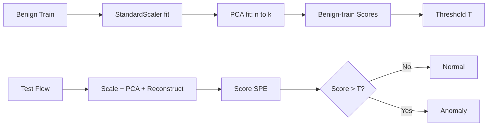
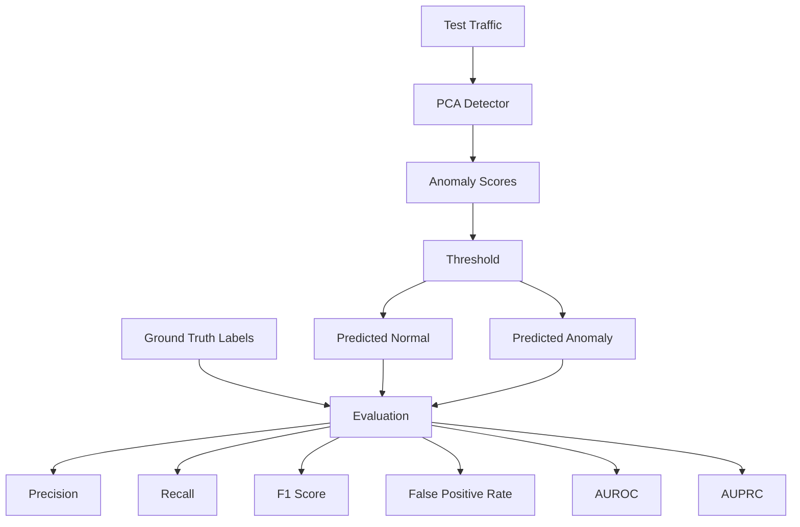
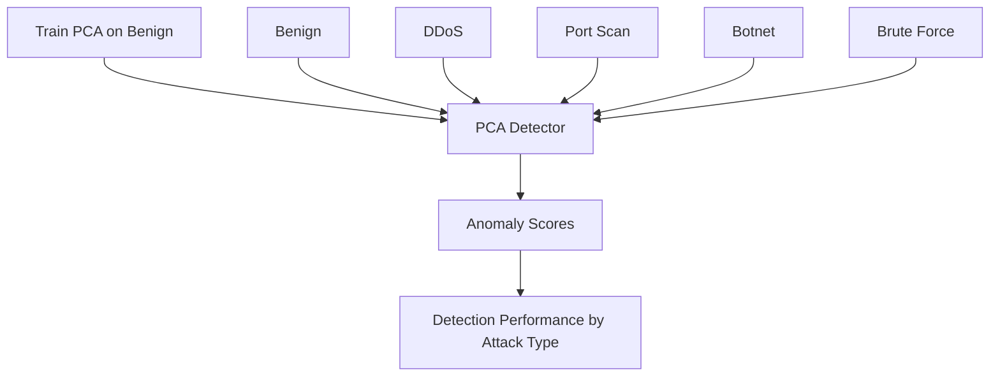
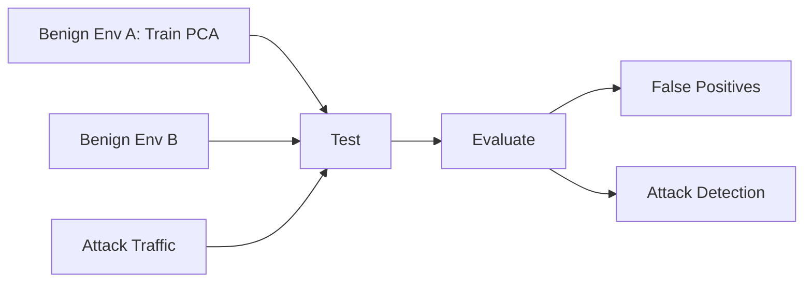
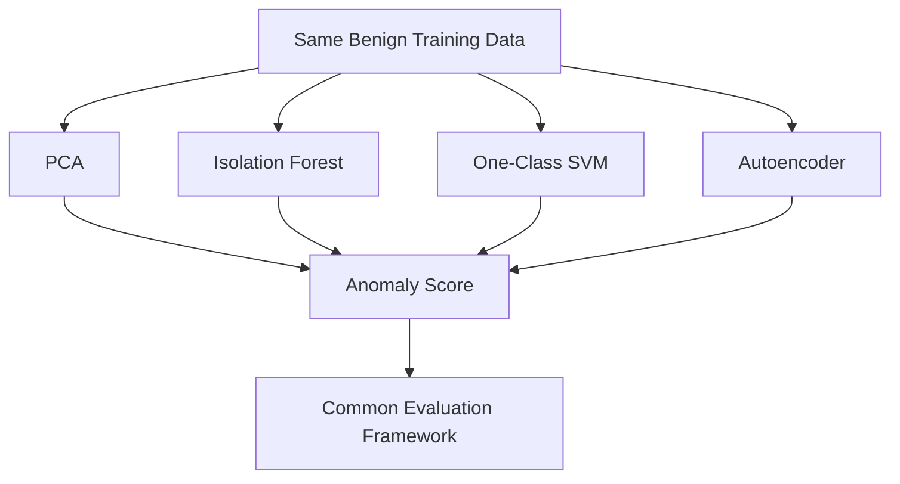

# EDR — Experiment Design & Evaluation Report

> **Project:** PCA-Based Network Anomaly Detection
> **File:** `EDR.md`
> **Companions:** `README.md` (research narrative), `ERD.md` (entities), `DRD.md` (data & design), `PRD.md`, `TRD.md`

This document is the **Experiment Design Report + Evaluation protocol**. It defines *what will be tested, how, with which metrics, and how results will be judged* — before results exist. Result tables are provided as **templates to fill** as `notebooks/03–06` are executed.

Central research question:

> **Can a low-dimensional representation of benign network behavior detect previously unseen attacks while remaining robust to benign distribution shifts?**

With the hard constraint:

```text
Unusual ≠ Malicious
P_train(X) ≠ P_test(X) does NOT imply attack.
```

---

## 1. Principles

1. **One-class discipline:** scaler + PCA + threshold fit on **benign-train only**. Labels used solely for scoring/slicing.
2. **Threshold-free + thresholded reporting:** always report **AUROC/AUPRC** (score quality) alongside **P/R/F1/FPR** at a fixed operating threshold.
3. **Slice everything:** every aggregate metric must be accompanied by per-attack and per-distribution slices — aggregates hide failures.
4. **Same-data fairness:** baselines share identical splits, features, and protocol.
5. **Negative results count:** Scenarios A–D in README §Expected Outcomes are all publishable; failure analysis is mandatory (Phase 8).

---

## 2. Fixed Protocol (applies to Exp1–Exp5)

### 2.1 Pipeline under test



Math:

```text
SPE(x) = ||x − x̂||² = Σᵢ (xᵢ − x̂ᵢ)² ;  Score = SPE (also store MSE = SPE/n)
Baseline T = Percentile_99(Scores_benign_train)
```

### 2.2 Component choices (frozen per run, logged per run)

| Component | Baseline | Sweep / alternatives |
|-----------|----------|----------------------|
| `n` features | cleaned numeric set (≈78) | alignment intersection for cross-dataset |
| `k` components | e.g. 15 / ≥95% variance | elbow sweep; record variance-retained |
| Scaler | `StandardScaler` | — (no alternative in v1) |
| Score | SPE | MSE (monotonic twin; report one) |
| Threshold | `P99` | `P95`, `P99.5`, `μ+2σ`, `μ+3σ`, MAD; adaptive `T_t = μ_t + kσ_t` as future work |
| Seed | fixed | repeat-key-splits if time permits |

### 2.3 Metrics (definitions in `README.md` → Evaluation Metrics)

| Metric | Formula / meaning | Why it matters here |
|--------|-------------------|---------------------|
| Precision | `TP/(TP+FP)` | Alert trust; collapses under shift-FPs |
| Recall (Detection Rate) | `TP/(TP+FN)` | Attack coverage; reported **per attack** |
| F1 | `2PR/(P+R)` | Single-threshold summary |
| FPR | `FP/(FP+TN)` | **Primary shift metric** on `shift-benign` |
| AUROC | P(score(attack) > score(benign)) | Threshold-free separability |
| AUPRC | PR-curve area | Imbalanced classes (attacks rare) |

Evaluation architecture:



### 2.4 Artefact contract per experiment

Each experiment produces (in `results/`):

```text
tables/scores_{exp}.csv        # flow_id, y_true, attack_category, split_role, spe, mse
tables/metrics_{exp}.csv       # one row per (slice × threshold)
tables/metrics_{exp}_per_attack.csv
figures/score_hist_{exp}.png   # benign vs attack score distributions + T line
figures/roc_{exp}.png / pr_{exp}.png
figures/shift_fpr_{exp}.png    # Exp4 only
reports/{exp}_summary.md       # filled template from §8
```

---

## 3. Experiment Matrix

| ID | Notebook | Research sub-question | Train | Test | Varies |
|----|----------|----------------------|-------|------|--------|
| **Exp1** | `03_pca_baseline` | Can PCA learn normal and flag mixed attacks? | benign-train (env A) | benign-test + mixed attacks (env A) | `k`, `T` |
| **Exp2** | `04` (A) | Which attack types are easy/hard? | benign-train | benign-test vs **each attack separately** | attack slice |
| **Exp3** | `04` (B) | Truly unseen categories? (all attacks unseen by construction — one-class) | benign-train | per-category holdout; report zero-shot framing | category |
| **Exp4a** | `05` | Temporal shift: `Mon-AM → Fri-PM` | benign `t0` | benign `t1` + attacks | time |
| **Exp4b** | `05` | Environment shift: `Net A → Net B` | benign A | benign B + attacks | env |
| **Exp4c** | `05` | Cross-dataset: `DS A → DS B` (aligned features) | benign A | benign B + attacks | dataset |
| **Exp5** | `06` | PCA vs IF / OCSVM / AE on identical data? | same benign-train | same test | model + runtime |

Roadmap mapping: Phase 4 → Exp1, Phase 5 → Exp2/3, Phase 6 → Exp4, Phase 7 → Exp5, Phase 8 → failure-driven improvement.

---

## 4. Detailed Designs

### Exp1 — Basic Anomaly Detection

- **H1:** Benign reconstruction error concentrates low; mixed attack error shifts high → AUROC clearly > 0.5, F1 reasonable at `P99`.
- **Procedure:**
  1. Fit scaler+PCA on `train-benign`.
  2. Score `test-benign` + `test-attack(mixed)`.
  3. Plot overlapping score histograms + `T=P99` line.
  4. Report all six metrics; confusion matrix.
  5. Ablate `k` (e.g. 5/10/15/25/40) and `T` (`P95/P99/P99.5/μ+2σ/μ+3σ`); record variance-retained.
- **Template — `metrics_exp1.csv`:**

| k | Threshold | Precision | Recall | F1 | FPR | AUROC | AUPRC | Support_B | Support_A |
|---|-----------|----------:|-------:|---:|----:|------:|------:|----------:|----------:|
| 15 | P99 | — | — | — | — | — | — | — | — |
| 15 | μ+3σ | — | — | — | — | — | — | — | — |

- **Pass notes:** not a gate — low scores trigger Exp2/Phase-8 diagnosis, not re-tuning on test.

### Exp2 — Per-Attack Evaluation

- **H2:** High-volume/structural attacks (e.g. DDoS) separate cleanly; low-and-slow / benign-mimicking attacks (e.g. slow brute-force, stealth scan) overlap benign scores.
- **Procedure:** freeze Exp1's best-`k` + `P99`; evaluate `BENIGN vs {DDoS, PortScan, Botnet, BruteForce, Other}` independently; one ROC/PR per slice + shared score-ridge plot.
- **Template — `metrics_exp2_per_attack.csv`:**

| Traffic Type | Mean SPE | Median SPE | Detection Rate @P99 | AUROC vs Benign | AUPRC | Support |
|--------------|---------:|-----------:|---------------------:|----------------:|------:|--------:|
| BENIGN (ref) | — | — | (FPR) — | — | — | — |
| DDoS | — | — | — | — | — | — |
| PortScan | — | — | — | — | — | — |
| Botnet | — | — | — | — | — | — |
| BruteForce | — | — | — | — | — | — |

- **Analysis prompts:** which attacks evade linear reconstruction? Which features reconstruct worst per attack (residual audit via `visualization.py`)?



### Exp3 — Unseen-Attack Framing

- Note: the detector is **one-class**, so *every* attack is unseen by construction. Exp3 makes this explicit for reviewers: hold out one category at a time from *any* supervised comparison, and (for baselines that could use labels) verify PCA uses none.
- **H3:** Detection degrades gracefully rather than collapsing on any single held-out category; worst-case category bounds the "open-world" claim.
- **Procedure:** leave-one-attack-out reporting using Exp2 slices; summarize min/median/max recall + AUROC across categories.
- **Template:**

| Held-out Attack | Recall @P99 | AUROC | Verdict (easy/hard) |
|-----------------|------------:|------:|---------------------|
| DDoS | — | — | — |
| PortScan | — | — | — |
| … | — | — | — |

### Exp4 — Distribution Shift (the core robustness test)

- **H4:** Under legitimate shift, FPR inflates even when attack recall holds → fixed `T` is the failure point, not PCA geometry per se.
- **Procedure (each of 4a/4b/4c):**
  1. Train on source benign (`P_A`); freeze scaler/PCA/`T`.
  2. Test on target benign (`P_B`) + same attack set.
  3. Report **ΔFPR = FPR_target − FPR_source** as headline, plus recall/AUROC retention.
  4. Plot score-distribution overlay (`train-benign` vs `shift-benign` vs `attack`) to show *why* FPR moved.
  5. Threshold sensitivity: re-sweep `T` on source only (never fit on target) and show FPR–recall frontier.



- **Template — `metrics_exp4.csv`:**

| Shift | FPR_source | FPR_target | ΔFPR | Recall_src | Recall_tgt | AUROC_tgt | AUPRC_tgt |
|-------|----------:|-----------:|-----:|----------:|----------:|----------:|----------:|
| Temporal (Mon→Fri) | — | — | — | — | — | — | — |
| Env (A→B) | — | — | — | — | — | — | — |
| X-dataset (A→B) | — | — | — | — | — | — | — |

- **Decision rule:** if `ΔFPR` large with AUROC retained → threshold/adaptation problem (motivates adaptive `T_t`, Phase 8). If AUROC also collapses → representation problem (motivates feature/model change).

### Exp5 — Baseline Comparison

- **H5 (null-friendly):** PCA is competitive on volumetric attacks and far cheaper; nonlinear/boundary models win only on benign-mimicking slices — the question is *when PCA suffices*.
- **Procedure:** identical `X_train/X_test`, identical metric code; tune each baseline minimally and disclose grids (IF `contamination`/`n_estimators`; OCSVM `ν/γ`; AE architecture/epochs/bottleneck); log train+infer wall-time and peak RAM.
- **Template — `metrics_exp5.csv`:**

| Model | Prec | Rec | F1 | FPR | AUROC | AUPRC | Train s | Infer s | Notes |
|-------|-----:|----:|---:|----:|------:|------:|--------:|--------:|:------|
| PCA (k=…) | — | — | — | — | — | — | — | — | — |
| IsolationForest | — | — | — | — | — | — | — | — | — |
| One-Class SVM | — | — | — | — | — | — | — | — | — |
| Autoencoder | — | — | — | — | — | — | — | — | — |

- Plus per-attack × model heatmap (recall) and FPR-bar chart.



---

## 5. Threshold Study (cross-cutting)

Baseline `T = P99(benign-train scores)` is a **starting operating point, not a claim**. Required sweep:

| Strategy | Formula | Reported |
|----------|---------|----------|
| Percentile | `P95 / P99 / P99.5` | FPR–recall curve |
| Gaussian | `μ + 2σ / μ + 3σ` | Same |
| Robust | `median + k·MAD` | Same |
| Adaptive (exploratory) | `T_t = μ_t + kσ_t` sliding window | Exp4 only; contamination risk noted |

Prediction rule throughout:

```text
Score(x) > T ⇒ Anomaly (1);  Score(x) ≤ T ⇒ Normal (0)
```

Deliverable: one FPR-vs-recall frontier plot per experiment + recommended operating `T` **chosen on train/validation only**.

---

## 6. Validity, Leakage & Ethics Controls

| # | Control |
|---|---------|
| V-01 | Scaler/PCA/threshold fit **exclusively** on benign-train; assert in code + log row counts by label at fit time. |
| V-02 | No test-informed `k`/`T` selection reported as headline — test-tuned variants labelled `post-hoc`. |
| V-03 | Cross-dataset runs use only aligned intersection features; alignment file committed. |
| V-04 | Small slices (`support < 500`) flagged; CIs or "low-support" badge rather than ranking on noise. |
| V-05 | Runtime/hardware disclosed for Exp5 timing claims. |
| V-06 | Defensive-research scope: authorized datasets only; no live capture tooling; licenses in `data/raw/README.md`. |

---

## 7. Failure Analysis → Improvement (Phase 8 gate)

After Exp1–Exp5, fill this before proposing any model change:

| Failure mode | Evidence | Hypothesis | Proposed fix | Validation |
|--------------|----------|------------|--------------|------------|
| High FPR under shift | Exp4 ΔFPR table + overlay plot | Fixed `T` miscalibrated; geometry OK (AUROC held) | Adaptive `T_t` / robust threshold | Re-run Exp4, same frozen models |
| Missed stealth attacks | Exp2 low-recall slice + residual audit | Linear subspace can't separate; attack on-manifold | Hybrid PCA+IF / AE on residuals | Re-run Exp2/Exp5 head-to-head |
| Threshold brittleness | Frontier plots cross across exps | Single `T` can't serve all envs | Per-env calibration protocol | Report per-env `T` + cost of calibration |
| Feature gaps | Residuals concentrate in 2–3 features | Missing temporal/statistical features | Add IAT/flag-entropy features | Ablate with/without |

Improvement is accepted only if it **beats the frozen PCA+P99 baseline on the pre-registered Exp4/Exp2 slices** without access to target labels at fit time.

Expected-outcome mapping (README): A→Exp2 stealth-miss table; B→Exp4 ΔFPR; C→§5 frontiers; D→Exp5 cost-vs-quality table.

---

## 8. Per-Experiment Report Template (`results/reports/{exp}_summary.md`)

```markdown
# {ExpID} — {Title}
- Train: {dataset/split/seed} | Test: {...} | k={} var={} | T={strategy=value}
- Headline (1 line): ...
- Metrics table: (paste from metrics_{exp}.csv)
- Figures: score_hist, ROC, PR (+ shift overlay if Exp4)
- What worked / what failed (3 bullets each):
- Leakage check (V-01 evidence):
- Link to notebook + commit hash:
```

---

## 9. Status & Placeholders

- **Status:** `DESIGN FROZEN — AWAITING RUNS` (repo currently docs-only; `PRD.md`/`TRD.md` empty shells).
- All `—` cells in §4 tables are intentional placeholders; fill during notebook execution.
- Research progression after runs:


---

## Appendix — Traceability

| README Section | EDR Coverage |
|----------------|--------------|
| Research Question, Objectives | §1, §3 matrix |
| Project Pipeline, Training Strategy, Anomaly Scoring, Thresholding | §2 protocol + §5 |
| Unseen Attack Detection | Exp2/Exp3 (§4) |
| Distribution Shift (temporal/env/cross-dataset) | Exp4 (§4) |
| Evaluation Metrics + Architecture | §2.3 |
| Baseline Models, Experimental Design Exp1–5 | §3–§4 |
| Future Work (adaptive T, hybrid, drift) | §5 + §7 |
| Expected Outcomes A–D, Philosophy | §7 + §1(5) |
