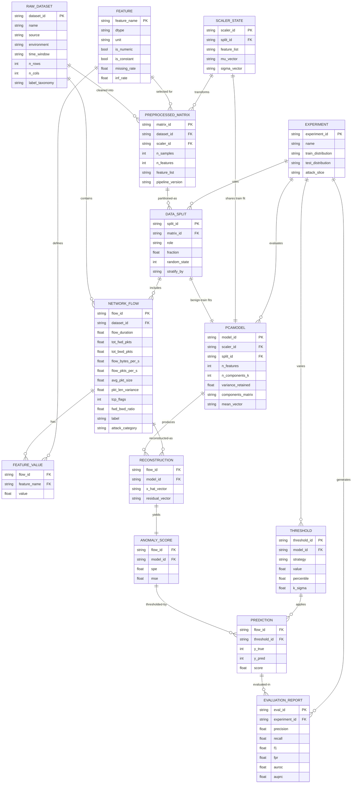

# ERD — Entity Relationship Document

> **Project:** PCA-Based Network Anomaly Detection
> **File:** `ERD.md`
> **Companions:** `README.md` (vision + pipeline), `PRD.md` (product requirements), `TRD.md` (technical requirements), `DRD.md` (data & design requirements), `EDR.md` (experiment design & evaluation)

---

## 1. Purpose

This document defines the **data entities, attributes, and relationships** for the PCA-based network anomaly detection framework.

It answers:

```text
What data exists?
What are its attributes?
How is it related?
What constraints hold?
How does it map to code (src/), notebooks/, and results/?
```

Scope is **flow-based network traffic** (e.g. CICIDS family, UNSW-NB15) modelled as numerical feature vectors, learned with a one-class PCA detector trained primarily on **benign** traffic and scored by **reconstruction error (SPE)**.

---

## 2. Design Principles

1. **One-class learning:** `PCA model` is fit on `Benign Training Flows` only. `Label` is used for evaluation, never for fitting scaler/PCA.
2. **No leakage:** `StandardScaler` + `PCA` parameters derive from train-benign only, then applied to all test data.
3. **Flow = one sample:** Each network flow is one `Feature Vector x ∈ R^n` (target `n ≈ 78`, reduced to `k ≈ 15`, tunable).
4. **Score = error:** `Anomaly Score = ||x - x̂||²` (SPE / MSE). Threshold `T` derives from benign train error distribution.
5. **Reproducibility:** Every derived entity records its parent IDs + pipeline version + random state.

---

## 3. Entity Summary

| # | Entity | Description | Primary Key | Produced By |
|---|--------|-------------|-------------|-------------|
| E1 | `RawDataset` | Original CSV(s) per environment/dataset (e.g. CICIDS Monday, UNSW-NB15) | `dataset_id` | `data/raw/` ingest |
| E2 | `NetworkFlow` | One flow record (row) with raw features + label | `flow_id` | `data_loader.py` |
| E3 | `Feature` | Column definition / selected numerical feature | `feature_name` | `feature_selection.py` |
| E4 | `PreprocessedMatrix` | Cleaned, aligned, scaled matrix ready for PCA | `matrix_id` | `preprocessing.py` |
| E5 | `DataSplit` | Train/test partition descriptor (benign-train, benign-test, attack-test) | `split_id` | `preprocessing.py` |
| E6 | `PCAModel` | Fitted PCA: components, mean, explained variance, `k` | `model_id` | `pca_detector.py` |
| E7 | `ScalerState` | Fitted `StandardScaler` (μ, σ per feature) | `scaler_id` | `preprocessing.py` |
| E8 | `Reconstruction` | `x̂` per flow + per-feature residual | `flow_id + model_id` | `pca_detector.py` |
| E9 | `AnomalyScore` | Scalar SPE/MSE per flow | `flow_id + model_id` | `pca_detector.py` |
| E10 | `Threshold` | Decision cutoff + strategy + fitted value | `threshold_id` | `thresholding.py` |
| E11 | `Prediction` | Binary decision Normal/Anomaly per flow | `flow_id + threshold_id` | `thresholding.py` |
| E12 | `EvaluationReport` | Metrics per experiment/slice (Precision, Recall, F1, FPR, AUROC, AUPRC) | `eval_id` | `evaluation.py` |
| E13 | `Experiment` | Exp1–Exp5 + baselines (IF, OCSVM, AE) | `experiment_id` | `notebooks/03–06` |

---

## 4. ER Diagram (Mermaid)



---

## 5. Entity Definitions

### E1 — `RawDataset`

A raw file set in `data/raw/`. One dataset per environment / day / source.

| Attribute | Type | Notes |
|-----------|------|-------|
| `dataset_id` | string PK | e.g. `cicids2017-mon`, `unsw-nb15` |
| `name` | string | Human name |
| `source` | string | CICIDS / UNSW-NB15 / other |
| `environment` | string | Network A / B, day, time window |
| `time_window` | string | e.g. `Mon-AM`, `Fri-PM` |
| `n_rows`, `n_cols` | int | Raw shape |
| `label_taxonomy` | string | e.g. `BENIGN,DDoS,PortScan,Botnet,BruteForce` |
| `checksum` | string | sha256 for reproducibility |

Constraints: immutable once ingested; `data/raw/README.md` records provenance + download URL + license.

### E2 — `NetworkFlow`

One flow = one sample `x = [x1 … xn]`.

Core flow attributes (subset; full list in `README.md` → Feature Engineering):

| Attribute | Example |
|-----------|---------|
| `flow_id` | `{dataset_id}#{row_idx}` |
| `Flow Duration` | `1200`, `35` |
| `Total Fwd/Bwd Packets` | `20`, `9000` |
| `Flow Bytes/s`, `Flow Packets/s` | `5400`, `800000` |
| `Avg Packet Size`, `Pkt Len Variance` | `270`, `60` |
| `TCP Flags`, `Fwd/Bwd Ratio` | categorical/counts → encoded or dropped if non-numeric |
| `Label` | `BENIGN` (train pool) vs attack string |
| `attack_category` | Normalised: `BENIGN,DDoS,PortScan,Botnet,BruteForce,Other` |

Constraints:

- `Label` never used to fit scaler/PCA.
- Infinite / NaN rows flagged, not silently dropped (see DRD Part A, §A3).

### E3 — `Feature`

Column-level metadata produced by `feature_selection.py` / notebook `02`.

| Attribute | Rule |
|-----------|------|
| `is_numeric` | Non-numeric dropped in v1 (documented) |
| `is_constant` | Zero-variance → dropped |
| `missing_rate`, `inf_rate` | If > threshold → drop or impute (decision logged) |
| `leakage_risk` | Columns derived from label (e.g. `Label`, `Attack IP`) → excluded |

Target: aligned common feature set across datasets for cross-dataset tests (Exp4c). Alignment map stored in `results/tables/feature_alignment.csv`.

### E4 — `PreprocessedMatrix`

Output of `preprocessing.py`: cleaned + selected + scaled matrix.

- `matrix_id = {dataset_id}+{pipeline_version}+{feature_hash}`
- Stores `feature_list` (ordered), `n_samples × n_features`.
- Standardization: `z = (x − μ)/σ` with μ,σ from **train-benign only**.

### E5 — `DataSplit`

| `role` | Meaning |
|--------|---------|
| `train-benign` | Fit scaler + PCA (e.g. 70–80% of benign) |
| `test-benign` | Held-out benign for FPR / threshold validation |
| `test-attack` | Attack pool, optionally sliced per category |
| `shift-benign` | Benign from different time/env/dataset (Exp4) |

Attributes: `fraction`, `random_state`, `stratify_by=attack_category`, parent `matrix_id`.

One-class rule: `train-benign` contains **only** `Label=BENIGN`.

### E6 — `PCAModel`

Fitted `sklearn.decomposition.PCA`.

| Attribute | Notes |
|-----------|-------|
| `n_features n` | e.g. 78 |
| `n_components_k k` | e.g. 15; chosen by cumulative variance (e.g. ≥95%) + elbow |
| `components_matrix` | `k × n` |
| `mean_vector` | PCA mean (in scaled space) |
| `variance_retained` | `Σ λ_1..k / Σ λ_1..n` |
| `scaler_id`, `split_id` | Lineage |

Math:

```text
x (scaled) → z = W_kᵀ(x − μ) → x̂ = W_k z + μ
z ∈ R^k, k < n
```

### E7 — `ScalerState`

Fitted `StandardScaler` on `train-benign`. Stores per-feature `μ`, `σ`. Reused verbatim at inference. Never refit on test.

### E8/E9 — `Reconstruction` + `AnomalyScore`

Per flow, per model:

```text
SPE(x) = ||x − x̂||²₂ = Σᵢ (xᵢ − x̂ᵢ)²
Score(x) = SPE(x)  (or MSE = SPE/n)
```

- Benign-like → `x ≈ x̂` → low score.
- Anomalous → `x ≉ x̂` → high score.

Stored in `results/tables/scores_{experiment}.csv` with columns `flow_id, y_true, spe, mse, split_role`.

### E10 — `Threshold`

| `strategy` | Formula |
|------------|---------|
| `percentile-99` (baseline) | `T = P99(Scores_benign_train)` |
| `percentile-95/99.5` | Sensitivity sweep |
| `mean+k*std` | `T = μ + kσ`, `k ∈ {2,3}` |
| `robust-mad` | Median + k·MAD |
| `adaptive` | `T_t = μ_t + kσ_t` over sliding window (future work) |

Decision rule:

```text
Score(x) > T ⇒ Anomaly (1)
Score(x) ≤ T ⇒ Normal (0)
```

### E11 — `Prediction`

Join of `AnomalyScore` + `Threshold` + ground truth. Basis for confusion matrix.

### E12 — `EvaluationReport`

One row per (experiment × threshold × attack slice). Metrics: Precision, Recall, F1, FPR, AUROC, AUPRC (threshold-free metrics computed from raw scores; see EDR §2.3). Artefacts: `results/tables/metrics_*.csv`, `results/figures/roc_*.png`.

### E13 — `Experiment`

| ID | Notebook | Question |
|----|----------|----------|
| Exp1 | `03_pca_baseline` | Can PCA separate benign vs mixed attack? |
| Exp2 | `04_unseen_attack` (part A) | Per-attack detection rate? |
| Exp3 | `04_unseen_attack` (part B) | Truly unseen categories? |
| Exp4 | `05_distribution_shift` | FPR under temporal/env/cross-dataset shift? |
| Exp5 | `06_baseline_comparison` | PCA vs IF / OCSVM / AE? |

---

## 6. Relationship Cardinalities

| Relationship | Cardinality | Enforced By |
|--------------|-------------|-------------|
| `RawDataset : NetworkFlow` | 1 : N | `flow_id` prefix = `dataset_id` |
| `NetworkFlow : Reconstruction` | 1 : N | One per `model_id` evaluated |
| `PCAModel : AnomalyScore` | 1 : N | Score table FK |
| `AnomalyScore : Prediction` | 1 : N | One per `threshold_id` |
| `Threshold : Prediction` | 1 : N | Threshold sweep |
| `Experiment : EvaluationReport` | 1 : N | One row per slice/threshold |
| `ScalerState : PCAModel` | 1 : 1 | Same `train-benign` fit; scaler pickle + model pickle share version |

Referential integrity rule: **no orphan scores** — every `AnomalyScore` must resolve to an existing `flow_id` + `model_id`; every `Prediction` must resolve to a `threshold_id` whose `model_id` matches the score's `model_id`.

---

## 7. Code / File Mapping

| Entity | Code | Artefact |
|--------|------|----------|
| `RawDataset`, `NetworkFlow` | `src/data_loader.py`, `notebooks/01_data_exploration.ipynb` | `data/raw/*`, `results/tables/dataset_profile.csv` |
| `Feature` | `src/feature_selection.py`, `notebooks/02_preprocessing.ipynb` | `results/tables/feature_report.csv`, `feature_alignment.csv` |
| `PreprocessedMatrix`, `ScalerState`, `DataSplit` | `src/preprocessing.py` | `data/processed/*.npz`, `scaler.pkl` |
| `PCAModel`, `Reconstruction`, `AnomalyScore` | `src/pca_detector.py`, `notebooks/03_pca_baseline.ipynb` | `pca_model.pkl`, `scores_*.csv` |
| `Threshold`, `Prediction` | `src/thresholding.py` | `thresholds.json`, `predictions_*.csv` |
| `EvaluationReport`, `Experiment` | `src/evaluation.py`, `src/visualization.py`, `notebooks/04,05,06` | `results/figures/*`, `results/tables/metrics_*.csv`, `results/reports/*.md` |

Planned layout (from `README.md`):

```text
pca-network-anomaly-detection/
├── data/raw/            # E1 (immutable) + README.md provenance
├── data/processed/      # E4 + E5 + E7 (.npz, scaler.pkl)
├── src/                 # E2–E12 logic
├── notebooks/01–06      # E13 experiments
├── results/figures/     # score hists, ROC/PR, shift plots
├── results/tables/      # profiles, scores, metrics CSVs
└── results/reports/     # per-experiment E12 summaries
```

---

## 8. Constraints & Validation Checklist

- [ ] `C1`: Scaler + PCA fit **only** on `train-benign`.
- [ ] `C2`: Feature order identical at train and inference (`feature_list` hash check).
- [ ] `C3`: No `Label`/`attack_category` column in `X` matrix.
- [ ] `C4`: `k < n`; `k` + variance-retained logged per model.
- [ ] `C5`: Threshold fit only on benign-train scores.
- [ ] `C6`: Every metric row links to (`experiment_id`, `model_id`, `threshold_id`, `split_id`).
- [ ] `C7`: Cross-dataset runs use aligned intersection features only.

---

## 9. Open Decisions (to confirm during Phase 1–2)

1. Exact `n` after cleaning (README example: 78 — confirm per dataset).
2. Exact `k` selection rule (95% variance vs elbow vs fixed 15).
3. SPE vs MSE as canonical score (store both; report one).
4. Attack taxonomy normalisation across CICIDS vs UNSW-NB15.
5. Whether to persist per-feature residuals or only scalar scores (storage trade-off).

---

## 10. Traceability to README

| README Section | ERD Coverage |
|----------------|--------------|
| Dataset, Feature Engineering, Preprocessing | E1–E5 |
| Training Strategy, How PCA Detects Anomalies | E6–E9 |
| Thresholding | E10–E11 |
| Evaluation Metrics, Evaluation Architecture | E12 |
| Experimental Design (Exp1–5), Baselines | E13 |
| Project Structure | §7 mapping |
