# PCA-Based Network Anomaly Detection

> **Can a low-dimensional representation of benign network behavior detect previously unseen attacks while remaining robust to distribution shifts?**

An unsupervised network anomaly detection framework based on **Principal Component Analysis (PCA)**, reconstruction error, and statistical thresholding.

This project investigates whether a model trained primarily on **benign network traffic** can learn the underlying structure of normal behavior and subsequently identify anomalous or previously unseen attacks.

Beyond basic anomaly detection, the project evaluates the robustness of PCA under:

* Previously unseen attack types
* Benign traffic distribution shift
* Temporal changes in network behavior
* Cross-environment and cross-dataset testing
* Different thresholding strategies
* Comparison with alternative anomaly detection models

---

## 📌 Table of Contents

* [Overview](#overview)
* [Research Question](#research-question)
* [Motivation](#motivation)
* [System Architecture](#system-architecture)
* [How PCA Detects Anomalies](#how-pca-detects-anomalies)
* [Project Pipeline](#project-pipeline)
* [Project Objectives](#project-objectives)
* [Dataset](#dataset)
* [Feature Engineering](#feature-engineering)
* [Experimental Design](#experimental-design)
* [Unseen Attack Detection](#unseen-attack-detection)
* [Distribution Shift](#distribution-shift)
* [Thresholding](#thresholding)
* [Evaluation Metrics](#evaluation-metrics)
* [Baseline Models](#baseline-models)
* [Project Structure](#project-structure)
* [Installation](#installation)
* [Usage](#usage)
* [Development Roadmap](#development-roadmap)
* [Future Work](#future-work)
* [Research Direction](#research-direction)
* [License](#license)

---

# Overview

Traditional intrusion detection systems are often trained using labeled examples of known attacks.

This creates a fundamental problem:

> **What happens when an attacker uses a technique that the model has never encountered during training?**

This project approaches network intrusion detection as an **anomaly detection problem**.

Instead of learning:

```text
Attack A
Attack B
Attack C
```

the primary model learns:

```text
What does normal network traffic look like?
```

The central idea is:

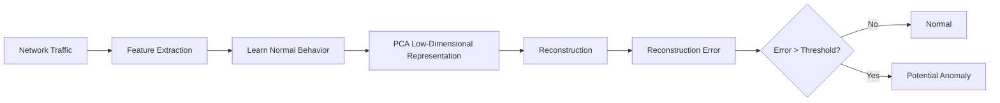

PCA learns the dominant structure of benign network traffic.

If new traffic follows the learned structure, it should be reconstructed with relatively low error.

If the traffic significantly deviates from the learned structure:

$$
x \not\approx \hat{x}
$$

then the reconstruction error increases:

$$
\text{Anomaly Score} = \left|x-\hat{x}\right|^2
$$

---

# Research Question

The central research question of this project is:

> **Can a low-dimensional representation of benign network behavior detect previously unseen attacks while remaining robust to benign distribution shifts?**

This leads to three major questions.

## 1. Can PCA learn normal network behavior?

$$
\text{Benign Traffic}
\rightarrow
\text{Low-Dimensional Representation}
$$

## 2. Can deviations from this representation reveal unseen attacks?

$$
\text{Unseen Attack}
\rightarrow
\text{Poor Reconstruction}
\rightarrow
\text{High Anomaly Score}
$$

## 3. Can the system distinguish an attack from a legitimate change in network behavior?

This is especially important because:

$$
\text{Unusual} \neq \text{Malicious}
$$

A legitimate network can change due to:

* Time of day
* User behavior
* New applications
* Infrastructure changes
* Network upgrades
* Seasonal or workload changes

Therefore:

$$
P_{\text{train}}(X) \neq P_{\text{test}}(X)
$$

does not necessarily mean an attack occurred.

---

# Motivation

Many machine learning models perform well when:

$$
P_{\text{train}}(X) \approx P_{\text{test}}(X)
$$

However, real networks are dynamic.

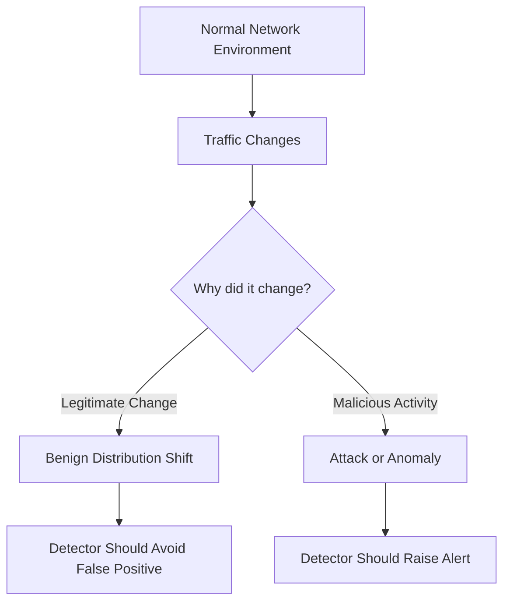

The difficulty is that both situations may appear statistically unusual.

The goal is therefore not simply:

> Detect anything unusual.

The deeper goal is:

> Detect genuinely anomalous or malicious behavior while remaining robust to legitimate changes in normal network traffic.

---

# System Architecture

The complete system is designed as a layered anomaly detection pipeline.

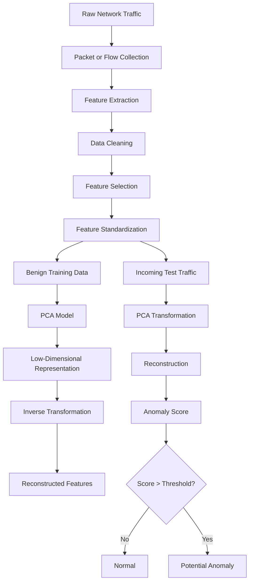

---

# How PCA Detects Anomalies

Each network flow can be represented as a feature vector:

$$
x = [x_1, x_2, x_3, \dots, x_n]
$$

For example:

```text
Flow Duration
Total Forward Packets
Total Backward Packets
Flow Bytes/s
Flow Packets/s
Average Packet Size
Packet Length Variance
TCP Flags
Forward/Backward Ratio
```

Suppose the original feature space contains:

$$
n = 78
$$

features.

PCA transforms the data into a lower-dimensional representation:

$$
x \rightarrow z
$$

where:

$$
z \in \mathbb{R}^{k}
$$

and:

$$
k < n
$$

For example:

$$
78 \rightarrow 15
$$

principal components.

The compressed representation is then reconstructed:

$$
z \rightarrow \hat{x}
$$

For traffic that resembles the learned benign structure:

$$
x \approx \hat{x}
$$

For unusual traffic:

$$
x \not\approx \hat{x}
$$

The reconstruction error becomes the anomaly score:

$$
SPE(x) = \left|x-\hat{x}\right|_2^2
$$

or:

$$
SPE(x) =
\sum_{i=1}^{n}(x_i-\hat{x}_i)^2
$$

---

# Project Pipeline

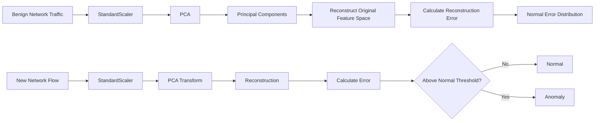

---

# Project Objectives

## Objective 1 — Build a PCA-Based Anomaly Detector

Train PCA primarily on benign traffic.


---

## Objective 2 — Detect Previously Unseen Attacks

The model should not need to observe every attack during training.

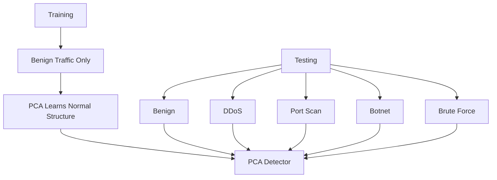

The question is:

> Can a model trained on normal traffic recognize attacks without having been explicitly trained on those attack labels?

---

## Objective 3 — Study Distribution Shift

Train on one distribution of benign traffic:

$$
P_A(X)
$$

and test on another:

$$
P_B(X)
$$

where:

$$
P_A(X) \neq P_B(X)
$$

Example:

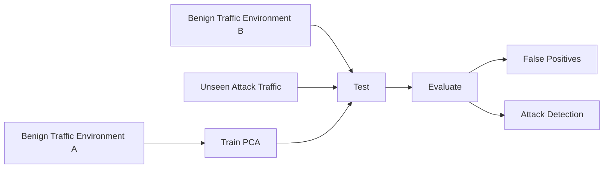

The goal is to determine whether the detector can distinguish:

```text
Changed but legitimate traffic
```

from:

```text
Malicious traffic
```

---

# Dataset

The project is designed for flow-based network intrusion datasets.

Potential datasets may include:

* CICIDS family datasets
* UNSW-NB15
* Other publicly available flow-based intrusion detection datasets

A typical dataset structure:

| Flow Duration | Packets/s | Bytes/s | Avg Packet Size | Label  |
| ------------: | --------: | ------: | --------------: | ------ |
|          1200 |        20 |    5400 |             270 | BENIGN |
|          1100 |        18 |    4900 |             272 | BENIGN |
|            35 |      9000 |  800000 |              60 | DDoS   |
|            40 |      7500 |  620000 |              58 | DDoS   |

The `Label` column is primarily used for evaluation.

The PCA model itself should learn primarily from benign traffic.

---

# Feature Engineering

Potential flow-level features include:

```text
Flow Duration
Total Forward Packets
Total Backward Packets
Total Length of Forward Packets
Total Length of Backward Packets
Forward Packet Length Mean
Backward Packet Length Mean
Flow Bytes/s
Flow Packets/s
Flow Inter Arrival Time
Average Packet Size
Packet Length Variance
TCP Flag Counts
Forward/Backward Packet Ratio
```

The final feature set will be selected based on:

* Missing values
* Infinite values
* Redundant features
* Constant features
* Data leakage
* Feature compatibility across datasets

---

# Data Preprocessing

The preprocessing pipeline:

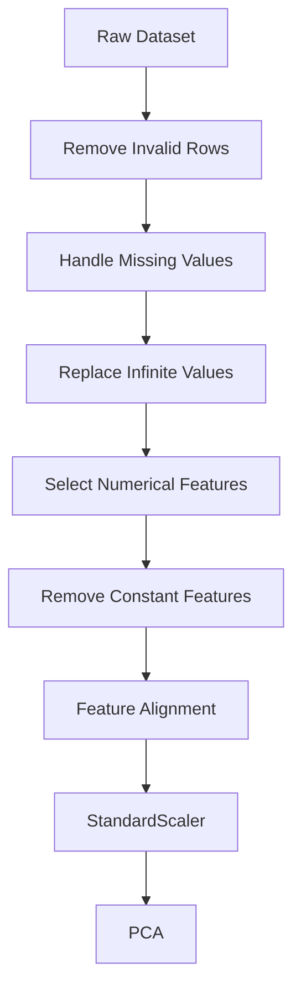

Feature standardization:

$$
z = \frac{x-\mu}{\sigma}
$$

This is essential because PCA is sensitive to feature scale.

Without standardization:

```text
Flow Duration = 2,000,000
Packet Count = 50
Flag Count = 1
```

Large-scale variables may dominate the learned components.

---

# Training Strategy

The baseline model follows a one-class learning strategy.

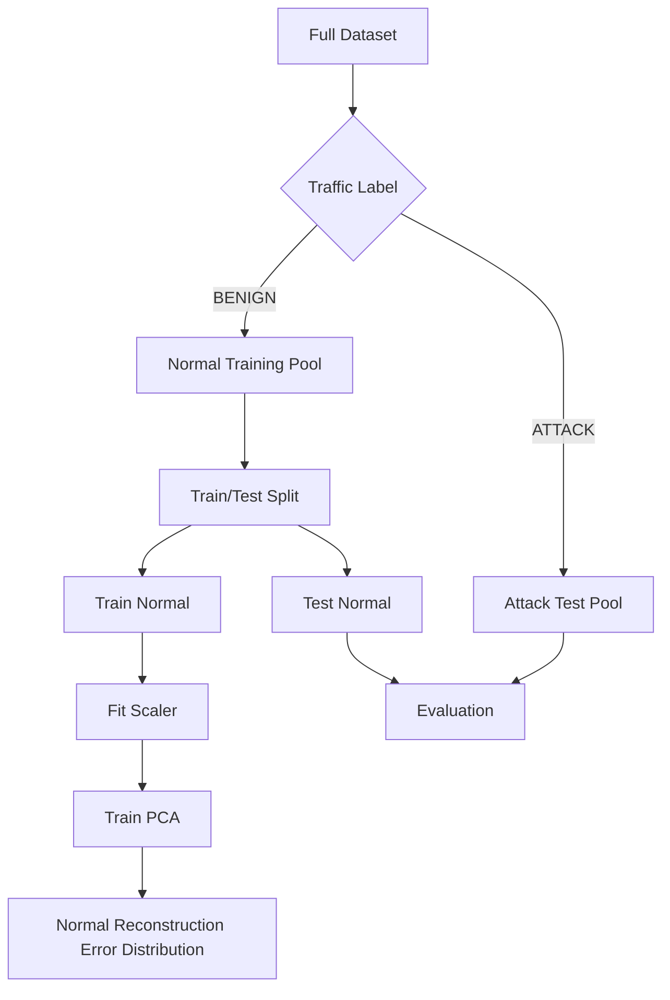

The scaler and PCA model must be fit only on training data.

This prevents data leakage.

---

# Anomaly Scoring

After PCA transformation and reconstruction:

$$
X \rightarrow Z \rightarrow \hat{X}
$$

The anomaly score is calculated as reconstruction error:

$$
Score(X)
========

\frac{1}{n}
\sum_{i=1}^{n}(x_i-\hat{x}_i)^2
$$

A larger value indicates that the sample does not fit the learned low-dimensional structure.

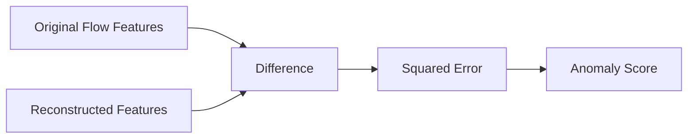

---

# Thresholding

A basic threshold can be calculated from reconstruction errors on benign training data.

For example:

$$
T =
Percentile_{99}(Scores_{benign})
$$


Prediction:

$$
Score(x) > T
\Rightarrow
Anomaly
$$

$$
Score(x) \leq T
\Rightarrow
Normal
$$

Threshold strategies to investigate:

* Percentile threshold
* Mean plus standard deviation
* Robust statistics
* Extreme value approaches
* Adaptive thresholding

---

# Unseen Attack Detection

A major experiment tests the detector against attacks that were not used to train the model.

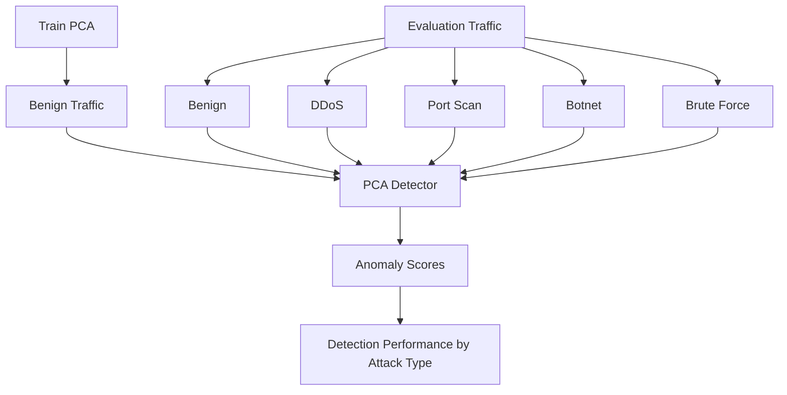

Example result table:

| Traffic Type | Mean Anomaly Score | Detection Rate |
| ------------ | -----------------: | -------------: |
| BENIGN       |                  — |              — |
| DDoS         |                  — |              — |
| Port Scan    |                  — |              — |
| Botnet       |                  — |              — |
| Brute Force  |                  — |              — |

This allows the project to answer:

> Which attack behaviors are easily distinguishable from benign traffic?

and:

> Which attacks resemble benign traffic closely enough to evade a simple PCA detector?

---

# Distribution Shift

Distribution shift occurs when the statistical properties of incoming traffic differ from training traffic.

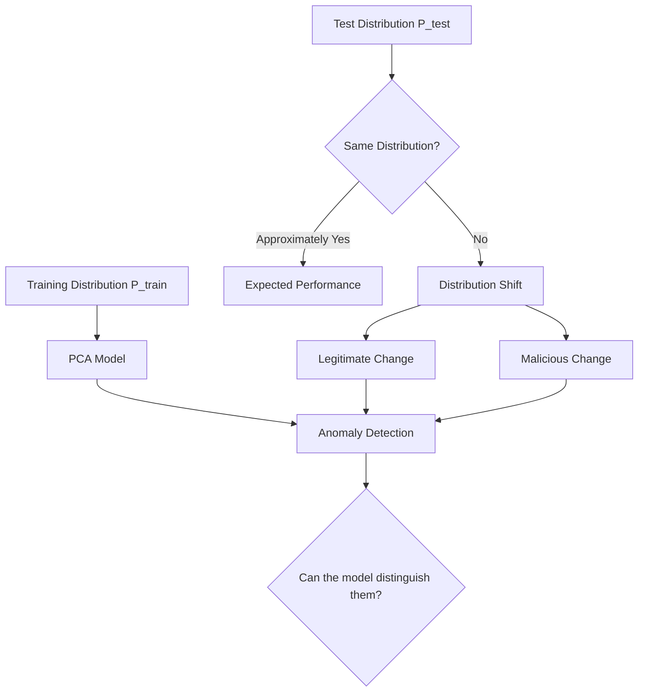

Potential experiments:

## Temporal Shift

```text
Train:
Monday Morning

Test:
Friday Evening
```

## Environment Shift

```text
Train:
Network A

Test:
Network B
```

## Cross-Dataset Shift

```text
Train:
Dataset A

Test:
Dataset B
```

The primary metric of interest is often:

$$
False\ Positive\ Rate
$$

on legitimately changed benign traffic.

---

# Evaluation Metrics

The detector will be evaluated using:

## Precision

$$
Precision =
\frac{TP}{TP+FP}
$$

## Recall

$$
Recall =
\frac{TP}{TP+FN}
$$

## F1 Score

$$
F1 =
2 \cdot
\frac{Precision \cdot Recall}
{Precision+Recall}
$$

## False Positive Rate

$$
FPR =
\frac{FP}{FP+TN}
$$

## AUROC

Measures the model's ability to separate normal and anomalous samples across thresholds.

## AUPRC

Particularly useful when anomaly classes are highly imbalanced.

---

# Evaluation Architecture

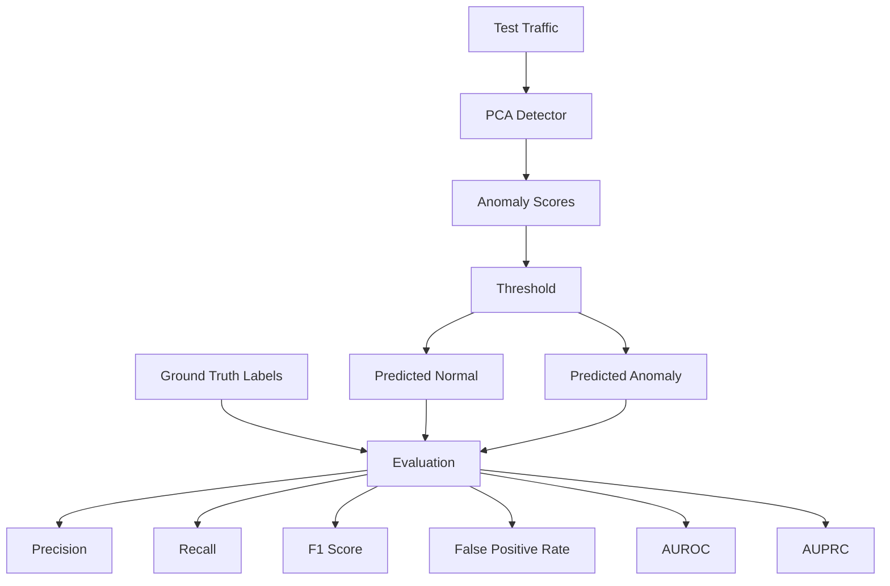

---

# Baseline Models

PCA should not be evaluated in isolation.

The project will compare it against additional anomaly detection approaches.

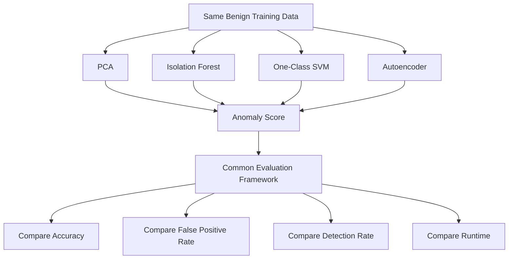

| Model            | Type                             |
| ---------------- | -------------------------------- |
| PCA              | Linear reconstruction            |
| Isolation Forest | Tree-based anomaly detection     |
| One-Class SVM    | Boundary-based novelty detection |
| Autoencoder      | Nonlinear reconstruction         |

The objective is not to assume that PCA is superior.

The objective is to understand:

> **When is PCA sufficient, and when is a more complex model necessary?**

---

# Experimental Design

The experimental design should proceed in stages.

## Experiment 1 — Basic Anomaly Detection

Train on benign traffic and test on:

```text
BENIGN
+
ATTACK
```

Measure:

* Precision
* Recall
* F1 Score
* AUROC
* AUPRC
* False Positive Rate

---

## Experiment 2 — Per-Attack Evaluation

Evaluate each attack independently.

```text
BENIGN vs DDoS

BENIGN vs Port Scan

BENIGN vs Botnet

BENIGN vs Brute Force
```

This identifies which attack types are naturally easier or harder for PCA to detect.

---

## Experiment 3 — Unseen Attack Evaluation

The detector is trained only on benign traffic.

The model is then tested on attack categories it has never explicitly seen.

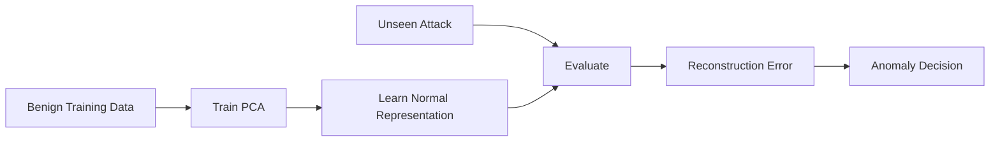

---

## Experiment 4 — Distribution Shift

Train and test under different benign distributions.

```text
Train:
Benign Environment A

Test:
Benign Environment B
+
Attack Traffic
```

Measure whether the model:

1. Detects attacks
2. Avoids falsely flagging legitimate changes

---

## Experiment 5 — Baseline Comparison

Compare:

```text
PCA
Isolation Forest
One-Class SVM
Autoencoder
```

Use consistent:

* Training data
* Feature preprocessing
* Evaluation protocol

---

# Project Structure

```text
pca-network-anomaly-detection/
│
├── data/
│   ├── raw/
│   │   └── README.md
│   │
│   └── processed/
│
├── notebooks/
│   ├── 01_data_exploration.ipynb
│   ├── 02_preprocessing.ipynb
│   ├── 03_pca_baseline.ipynb
│   ├── 04_unseen_attack_evaluation.ipynb
│   ├── 05_distribution_shift.ipynb
│   └── 06_baseline_comparison.ipynb
│
├── src/
│   ├── __init__.py
│   ├── data_loader.py
│   ├── preprocessing.py
│   ├── feature_selection.py
│   ├── pca_detector.py
│   ├── thresholding.py
│   ├── evaluation.py
│   └── visualization.py
│
├── results/
│   ├── figures/
│   ├── tables/
│   └── reports/
│
├── tests/
│
├── requirements.txt
├── README.md
└── LICENSE
```

---

# Installation

Clone the repository:

```bash
git clone https://github.com/<username>/pca-network-anomaly-detection.git
cd pca-network-anomaly-detection
```

Create a virtual environment:

```bash
python -m venv .venv
```

Activate it.

### Windows

```bash
.venv\Scripts\activate
```

### Linux / macOS

```bash
source .venv/bin/activate
```

Install dependencies:

```bash
pip install -r requirements.txt
```

---

# Core Dependencies

```text
numpy
pandas
scikit-learn
matplotlib
jupyter
```

Additional libraries may be introduced as experiments expand.

---

# Usage

The typical workflow is:


Example:

```bash
python -m src.preprocessing
python -m src.pca_detector
python -m src.evaluation
```

Notebook-based development can be started with:

```bash
jupyter notebook
```

---

# Development Roadmap

## Phase 1 — Data Understanding

* [ ] Inspect dataset structure
* [ ] Identify labels
* [ ] Identify numerical features
* [ ] Check missing values
* [ ] Check infinite values
* [ ] Study class imbalance

---

## Phase 2 — Preprocessing

* [ ] Clean invalid values
* [ ] Remove unusable features
* [ ] Standardize numerical data
* [ ] Split benign training and testing data
* [ ] Prepare attack evaluation data

---

## Phase 3 — PCA Baseline

Implement:

$$
Features
\rightarrow
PCA
\rightarrow
Reconstruction
\rightarrow
Error
\rightarrow
Threshold
$$

Tasks:

* [ ] Train PCA
* [ ] Select number of components
* [ ] Reconstruct samples
* [ ] Calculate reconstruction error
* [ ] Implement thresholding

---

## Phase 4 — Baseline Evaluation

Evaluate:

* [ ] Normal traffic
* [ ] Known attack traffic
* [ ] Per-class detection rate
* [ ] False positives
* [ ] False negatives
* [ ] Precision
* [ ] Recall
* [ ] F1 Score
* [ ] AUROC
* [ ] AUPRC

---

## Phase 5 — Unseen Attack Testing

Run separate tests for:

* [ ] DDoS
* [ ] Port Scan
* [ ] Botnet
* [ ] Brute Force
* [ ] Additional attack categories

Ask:

> Which attacks are easy for PCA to detect?

> Which attacks look similar to benign traffic?

---

## Phase 6 — Distribution Shift

Test:

```text
Benign Environment A → Train

Benign Environment B → Test
```

Measure:

* [ ] False positive rate
* [ ] Recall
* [ ] F1 score
* [ ] AUROC
* [ ] AUPRC

---

## Phase 7 — Baseline Comparison

Compare:

* [ ] PCA
* [ ] Isolation Forest
* [ ] One-Class SVM
* [ ] Autoencoder

---

## Phase 8 — Research Improvement

Look at the actual experimental results and identify the failure mode.

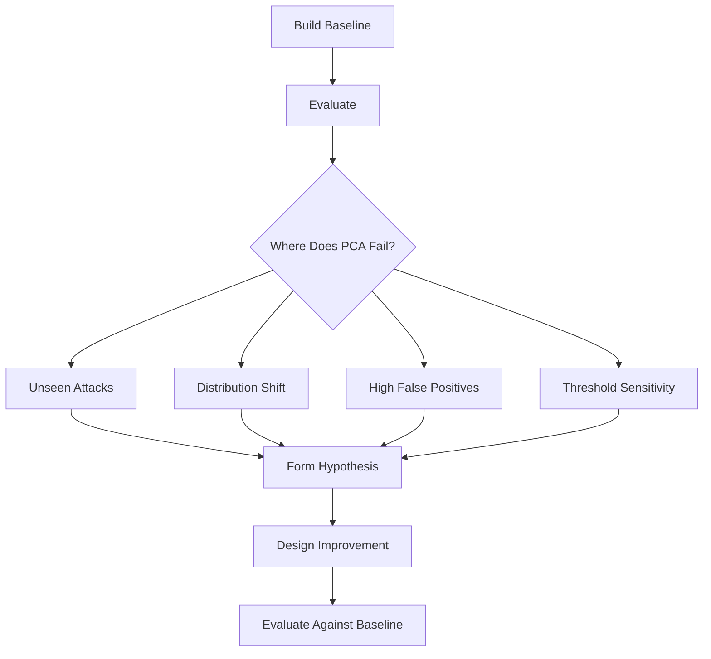

The final improvement should be motivated by experimental evidence.

---

# Future Work

Depending on experimental results, the project may explore:

## Adaptive Thresholding

Instead of:

$$
T = constant
$$

investigate:

$$
T_t = \mu_t + k\sigma_t
$$

where:

* $\mu_t$ = recent mean reconstruction error
* $\sigma_t$ = recent standard deviation
* $k$ = sensitivity parameter

---

## Robust Online Adaptation

Investigate whether the detector can update its understanding of normal traffic without allowing malicious traffic to contaminate the definition of normal.

---

## Hybrid PCA and Nonlinear Models

Possible combinations:

* PCA + Autoencoder
* PCA + Isolation Forest
* PCA + statistical detector

---

## Open-World Anomaly Detection

Investigate whether the system can distinguish:

```text
Known Normal
Known Anomalous
Previously Unseen Anomalous Behavior
```

---

## Concept Drift Detection

Monitor changes in:

$$
P_t(X)
$$

over time.

---

# Research Direction

The project should evolve through the following sequence:

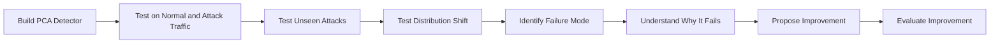

The key philosophy of this project is:

> **Do not begin by building the most complicated model. Begin with the simplest correct model, understand where it fails, and let experimental evidence determine the next research direction.**

---

# Expected Research Outcomes

The project does not assume that PCA will succeed.

Both positive and negative results are valuable.

Possible findings include:

## Scenario A

> PCA successfully detects high-volume attacks such as DDoS but struggles with low-and-slow attacks that closely resemble benign behavior.

## Scenario B

> PCA achieves strong attack detection performance but suffers from high false-positive rates under benign distribution shift.

## Scenario C

> A fixed threshold is insufficient across changing traffic conditions, while an adaptive strategy improves robustness.

## Scenario D

> PCA performs competitively with more complex models while requiring significantly lower computational resources.

Each of these outcomes can contribute to a stronger understanding of practical network anomaly detection.

---

# Project Philosophy

This repository is intended to document the full research process:

```text
Build
   ↓
Measure
   ↓
Find Failure
   ↓
Form Hypothesis
   ↓
Experiment
   ↓
Improve
   ↓
Validate
```

The goal is not simply to achieve the highest possible accuracy on a benchmark dataset.

The goal is to understand:

> **What assumptions allow an anomaly detector to work, when those assumptions break, and how the system can be made more robust in realistic network environments.**

---

# Status

🚧 **Active Development**

Current planned progression:

* [ ] Dataset Selection
* [ ] Exploratory Data Analysis
* [ ] Data Cleaning
* [ ] Feature Engineering
* [ ] PCA Baseline
* [ ] Reconstruction Error
* [ ] Statistical Thresholding
* [ ] Baseline Evaluation
* [ ] Unseen Attack Testing
* [ ] Distribution Shift Testing
* [ ] Baseline Model Comparison
* [ ] Failure Analysis
* [ ] Research Improvement

---

# Disclaimer

This project is intended for **authorized cybersecurity research, machine learning experimentation, and defensive network analysis**.

All datasets and traffic used in experiments should be obtained or generated in environments where analysis is permitted.

---

# License

This project will be released under an appropriate open-source license.

A suitable default is the **MIT License**.

---

# Project Summary

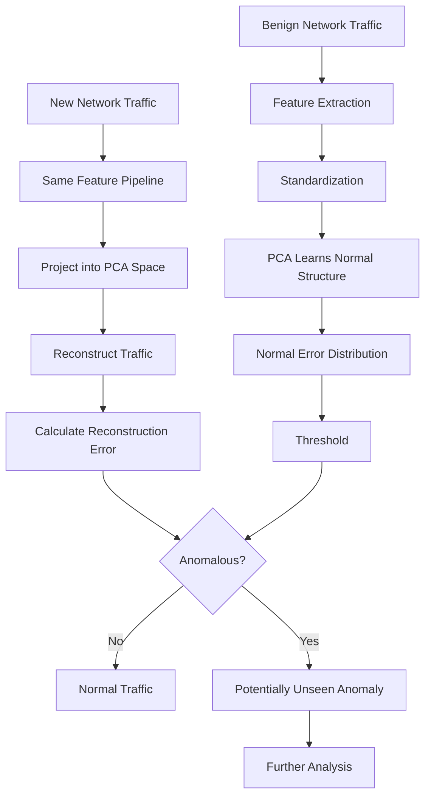

## Core Question

> **Can a compact representation of normal network behavior identify previously unseen malicious activity without incorrectly treating legitimate changes in network behavior as attacks?**
